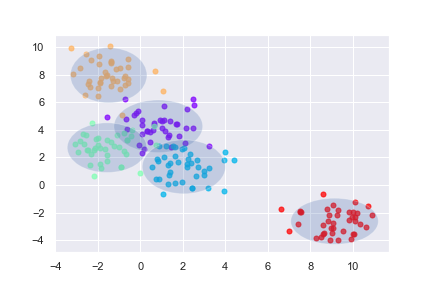
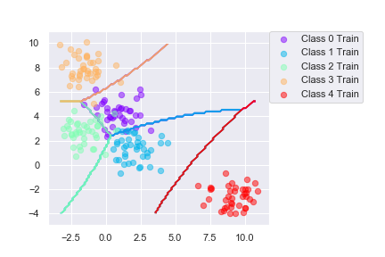

# Naive Bayes and Boosting

## Assignment 1

* Write function `mlParams(X,labels)` to estimate $'\mu_k'$ and $'\Sigma_k'$ for the different class k in the dataset.

* Use `genBlobs()` and `plotGaussians` to verify the code.
 

 
 ## Assignment 2

* Write function `computePrior(labels)` to estimate the class prior.

* Write function `classifyBayes(X,prior,mu,sigma)` to find the discriminant function values for all classes and classifies each point to belong to the max discriminant value.

## Assignment 3

Run `testClassifier` for the datasets `iris` and `vowels`. Plot the decision boundary of the 2D `iris` dataset.

### Questions

1. When can a feature independence assumption be reasonable and when not?
    * When the inputs are irrelevant, less correlated the independence assumption is reasonable. For example, the color, shape, size are less correlated. In this case, in 2D, the ellipse describing covariance matrix is not skew, preading into 2 direction of the axis as example in assignment 1.
    * In contrast, the inputs are relevant the assumption is not reasonable. For example, the size, weight are high correlated. In 2D, the ellipse of covariance matrix is skew as in `iris` dataset.

2. How does the decision boundary look for the Iris dataset? How could improve the classification results for this scenario by changing classisier or, alternatively, manipulating the data?

    * The decision boundary for the Iris dataset looks simple and not good (there are some misclassifications) since the independence assumption does not hold. A rotation for the dataset can improve the classifying. This transformation makes naive assumption to be met. A rotation of $45^o$ improve the accuracy from 89% to 96%.
    
## Assignment 4

Extend function `mlParams(X,labels,W)` to which handles weight $W$.

## Assignment 5

* Modify `computePrior(labels,W)` which taking weight W into account. The prior of a class is total weights of points $`x_i`$ in this class.

* Design function `trainBoost(base_classifier, X, labels, T)` which implement the Adaboost algorithm.

* Design function `classifyBoost(X, classifiers, alphas, Nclasses)` to classify X by means of the aggregated boosted classifier.

### Questions

1. Compute the classification accuracy of Bayesian classifier and its boosted version on some datasets using `testClassifier`, 

    * for `iris` we get `Final mean classification accuracy  89 with standard deviation 4.16` and `Final mean classification accuracy  94.7 with standard deviation 2.82`; 
    
    * for `vowels` we get `Final mean classification accuracy  64.7 with standard deviation 4.03` and `Final mean classification accuracy  80.2 with standard deviation 3.52`.
    
In both cases, NB gets low bias and boosting improves this. 

    * However, for `wine` dataset boosting does not improve the accuracy because naive Bayes performs well classification (the accuracy is 97.6%) and the size of input is not large enough (n = 178).

2. Plot the decision boundary of the boosted classifier on `iris`. Compare to the plot of the basic, the classification is more exactly and looks like more complex (not so smoother as the basic one).

3. Boosting is ensemble methods improve the bias of weak learning algorithms. Therefore, we can make up for using a simple model (low bias/ high variance) in the basic classifier by using boosting.

## Assignment 6

Test the decision tree classifier on the `vowels` and `iris` datasets. The put it as an argument to the `BoostClassifier` object. 

1. Compute the classification accuracy of Bayesian classifier and its boosted version on some datasets using `testClassifier`, 

    * for `iris` we get `Final mean classification accuracy  92.4 with standard deviation 3.71` and `Final mean classification accuracy  94.6 with standard deviation 3.65`; 
    
    * for `vowels` we get `Final mean classification accuracy  64.1 with standard deviation 4` and `Final mean classification accuracy  87 with standard deviation 2.97`;
    
    * for `wine` we get `Final mean classification accuracy  91.1 with standard deviation 4.22` and `Final mean classification accuracy  92 with standard deviation 3.78`.
    
All of them, boosting improves the accuracy. The lower bias model is the more efficient the boosting is. 

2. Plot the decision boundary of the boosted classifier on `iris`. Compare to the plot of the basic, the classification is more exactly and looks like more complex (less smooth).

## Assignment 7

Pick a classifier, naive Bayes or decision tree or the boosted versions of these for the following criteria:

* Outliers: Decision tree without boosting. Boosting weights outliers then is sensitive to them.

* Irrelevant inputs (part of the feature space is irrelevant): Naive Bayes. Irrelevent inputs make independence assumption to be met.

* Predictive power: Boosted Decision Tree or Decision Tree. NB use the probability that leads to inaccurate in predicting. 

* Mixed types of data (binary, categorical or continuous features, ...): Decision Tree. NB is sensitive with mixed types of data. It works well with a continous type of data.

* Scalability (the dimension of the data, D, is large or the number of instances, N, is large, or both): Naive Bayes or boosted NB. When the dimension of number of data become too big, DT requires too much cost in classification (time and space). Boosted DT can overfit when the number of tree is too large. NB is simple and fast. Besides that by using boosting the accuracy can be improve.